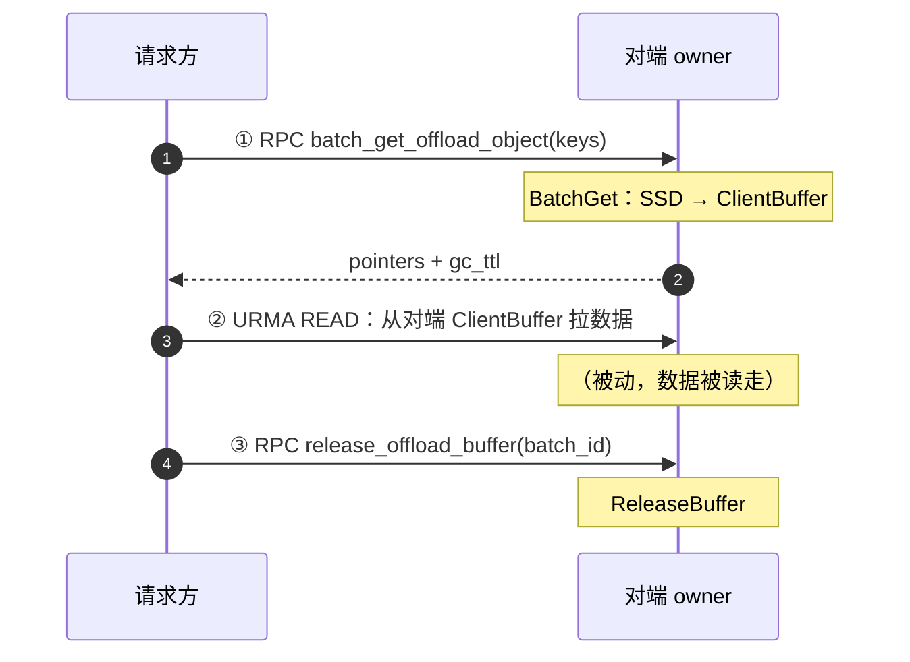
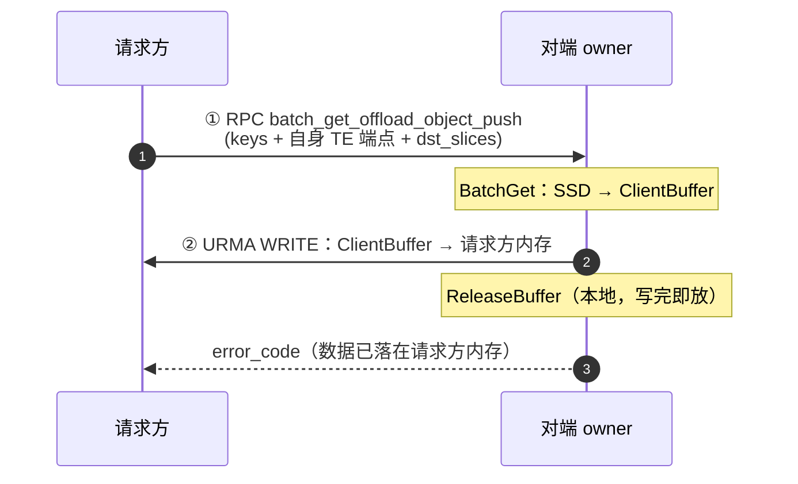
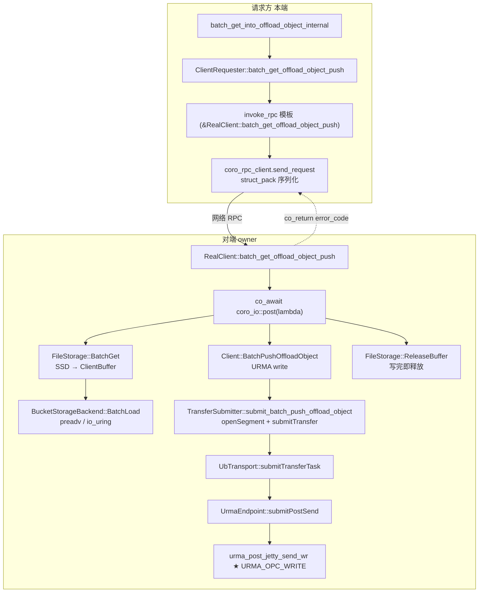
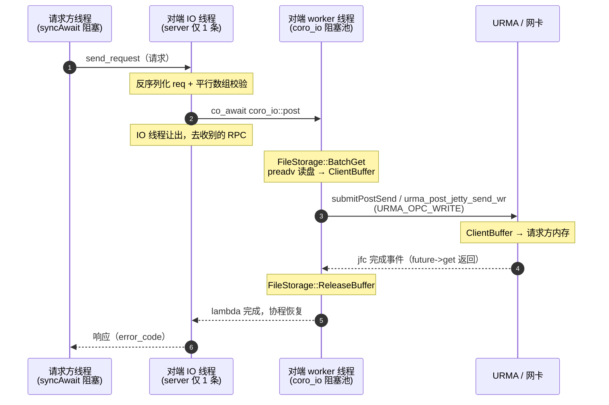

# Mooncake SSD Offload —— Push 读取模式（URMA write 为例）

> 本文档描述 `feature/offloadrpc` 分支引入的 **Push 读取模式**,作为 [offload-mechanism.md](offload-mechanism.md) 第 2.2 节「Load（SSD → 请求方）」的扩展。
> 传输层以 **UB / URMA** 为例(`URMA_OPC_WRITE` 单边写);RDMA 等其它 transport 走同一套抽象,不单独展开。
> 关联开关:`MC_OFFLOAD_PUSH`。

---

## 1. 背景与动机

当一个对象只在远端节点的 SSD 上时,请求方需要把它从对端磁盘读回本地内存。原有实现(下称 **Pull 模式**)由**请求方主动发起**,一次 Load 要 **3 次 RPC / 单边操作**;**Push 模式**把单边传输的方向对调,由**数据持有方(owner)主动 URMA write**,一次 Load 只需 **1 次 RPC 往返**。

### 1.1 Pull vs Push 流程图

**Pull 模式（请求方主动拉，3 次往返）**



**Push 模式（持有方主动推，1 次往返）**



**收益**:消除请求方侧的 URMA READ 往返,以及单独的 `release_offload_buffer` RPC —— 由对端写完后就地释放 buffer。

**不变的部分**:对端仍必须先把 SSD 数据读进**已注册的 ClientBuffer**(`FileStorage::BatchGet`)。URMA 单边写的源必须是注册过的内存段(`urma_register_seg` 得到的 `urma_target_seg_t`),SSD 上的数据无法绕过这块中转直接走网卡。Push 省的是后续步骤,不是这次 SSD→内存的拷贝。

---

## 2. 设计要点

### 2.1 方向对调（Pull READ ↔ Push WRITE）

两条传输函数互为镜像,只差三个字段;最终都落到 URMA 的同一套 `urma_jfs_wr_t`,仅 `opcode` 与 SGE 方向不同:

| | Pull `submit_batch_get_offload_object` | Push `submit_batch_push_offload_object` |
|---|---|---|
| `TransferRequest::opcode` | `READ` | `WRITE` |
| `openSegment` 的对象 | 对端(owner)的 segment | **请求方**的 segment |
| `source`(本地) | 请求方目标分片 `slice.ptr` | **对端 ClientBuffer** `src_pointer` |
| `target_offset`(远端) | 对端 ClientBuffer 地址 | **请求方目标分片地址** `dst.addr` |
| URMA `wr.opcode` | `URMA_OPC_READ` | `URMA_OPC_WRITE` |
| 发起方 | 请求方 | 对端 |

### 2.2 成立前提:两端内存都注册为 URMA segment

- **对端 ClientBuffer**:`FileStorage::RegisterLocalMemory()` 注册到对端 transfer engine,底层经 `urma_register_seg` 得到本地段 `l_seg`,可作为 WRITE 的源(local SGE)。
- **请求方目标内存**:应用 GET 时传入的 `objects` 分片本就注册过;对端 `openSegment(requester_te_addr)` 把它**导入**为远端段 `r_seg`(remote SGE)+ 远端 `tjetty`,WRITE 才能寻址过去。

### 2.3 非连续目标分片

对端某个 key 的数据是**一整块连续** ClientBuffer;请求方接收内存可能是**多段非连续**分片(GPU 显存常见)。Push 按 `dst.size` 累加 `offset`,把连续源切到各目标分片,逐段生成一条 `TransferRequest` → 一条 `urma_jfs_wr_t`。

### 2.4 ub / urma 适配

Push 改动全部位于 `TransferSubmitter::submit_*` 层,只改 `opcode/source/target_offset`,**未触碰任何具体 transport**。`MultiTransport` 按端点自动选到 `UbTransport`;`urma_endpoint.cpp` 已支持 `URMA_OPC_WRITE` 且 SGE 方向自动反转,注册时 access 已开 `READ|WRITE|ATOMIC`。Push 无需为 ub/urma 写第二份逻辑。

---

## 3. RPC 数据结构（`mooncake-store/include/rpc_types.h`）

```cpp
// 请求方一个目标分片：对端 URMA write 时写入的目的地址 + 长度
struct OffloadDstSlice {
    uint64_t addr;   // 请求方目标内存虚拟地址
    uint64_t size;   // 该分片字节数
};
YLT_REFL(OffloadDstSlice, addr, size);

// Push 请求体
struct BatchGetOffloadObjectPushRequest {
    std::vector<std::string> keys;          // 租户作用域 storage key
    std::vector<int64_t>     sizes;         // 每个 key 总字节数
    std::string              requester_te_addr;  // 请求方 transfer engine 端点
    std::vector<std::vector<OffloadDstSlice>> dst_slices;  // 每个 key 一组目标分片
};
YLT_REFL(BatchGetOffloadObjectPushRequest, keys, sizes, requester_te_addr, dst_slices);

// Push 响应体（数据已落在请求方内存，仅回状态码）
struct BatchGetOffloadObjectPushResponse {
    ErrorCode error_code;
};
YLT_REFL(BatchGetOffloadObjectPushResponse, error_code);
```

- `YLT_REFL` 是序列化反射宏;不加它,struct_pack 无法在 RPC 中编解码这些结构。
- **不变量**:`keys`、`sizes`、`dst_slices` 是三个**平行数组**,长度必须相等,下标 `i` 描述同一个 key。handler 在进入任何按下标循环前先校验等长,坏请求直接 `INVALID_PARAMS` 拒绝(fail-fast,防越界/错位)。

---

## 4. 改动清单（逐文件）

| 文件 | 改动 |
|---|---|
| `include/rpc_types.h` | 新增 `OffloadDstSlice` / `BatchGetOffloadObjectPushRequest` / `…PushResponse` |
| `include/transfer_task.h`、`src/transfer_task.cpp` | 新增 `submit_batch_push_offload_object`(WRITE 版传输);header 增加 `#include "rpc_types.h"` |
| `include/client_service.h`、`src/client_service.cpp` | 新增 `Client::BatchPushOffloadObject`(提交传输 + 等 future 完成) |
| `include/real_client.h`、`src/real_client.cpp` | 新增对端 handler `batch_get_offload_object_push`;请求方 `batch_get_into_offload_object_internal` 增加 `MC_OFFLOAD_PUSH` 分支 |
| `include/pyclient.h`、`src/real_client.cpp` | 新增 `ClientRequester::batch_get_offload_object_push`(invoke_rpc 封装) |
| `src/real_client.cpp`、`src/real_client_main.cpp` | 两处 server 各 `register_handler` 新 handler |

> ⚠️ **handler 必须两处都注册**:内嵌 server(`real_client.cpp` 的 `offload_rpc_server_`)和独立进程 server(`real_client_main.cpp`)。漏一处,对应部署形态下 push 会因「RPC 未注册」失败。

---

## 5. 调用链总览



---

## 6. 关键代码解读

### 6.1 请求方入口:`batch_get_into_offload_object_internal`（`src/real_client.cpp`）

收集目标地址,按 `MC_OFFLOAD_PUSH` 分流到 Push 或保留 Pull:

```cpp
std::vector<std::vector<OffloadDstSlice>> dst_slices;
for (const auto &object_it : objects) {
    storage_keys.emplace_back(MakeTenantScopedStorageKey(...));
    int64_t total = 0;
    std::vector<OffloadDstSlice> key_dst;
    for (const auto &s : object_it.second) {
        total += s.size;
        key_dst.emplace_back(reinterpret_cast<uint64_t>(s.ptr), s.size);   // 应用目标内存地址+长度
    }
    sizes.emplace_back(total);
    dst_slices.emplace_back(std::move(key_dst));                           // 与 storage_keys 对齐
}

static const bool kOffloadPush = []() {                                    // 只读一次环境变量并缓存
    const char *v = std::getenv("MC_OFFLOAD_PUSH");
    return v && (std::string_view(v) == "true" || std::string_view(v) == "1");
}();
if (kOffloadPush) {
    BatchGetOffloadObjectPushRequest push_req;
    push_req.keys              = storage_keys;
    push_req.sizes             = sizes;
    push_req.requester_te_addr = client_->GetSegmentEndpoint();            // 自身 TE 端点
    push_req.dst_slices        = std::move(dst_slices);
    auto pushResp = client_requester_->batch_get_offload_object_push(target_rpc_service_addr, push_req);
    if (!pushResp) { return tl::make_unexpected(pushResp.error()); }       // RPC 层失败
    if (pushResp->error_code != ErrorCode::OK) { return tl::make_unexpected(pushResp->error_code); }
    return {};   // ★ Push 到此结束：无 READ、无 release
}
// 否则走下方原有 Pull 链路（完全保留）
```

`s.ptr` 是应用 GET 时给定的目标内存(已注册段),转成 `uint64_t` 即 `OffloadDstSlice::addr`,与 URMA `r_sge.addr` 语义一致。

### 6.2 对端 handler:`RealClient::batch_get_offload_object_push`（`src/real_client.cpp`）

读盘 + URMA write + 释放,在一个线程池任务里完成:

```cpp
async_simple::coro::Lazy<tl::expected<BatchGetOffloadObjectPushResponse, ErrorCode>>
RealClient::batch_get_offload_object_push(const BatchGetOffloadObjectPushRequest &req) {
    if (!file_storage_) { co_return tl::make_unexpected(ErrorCode::INVALID_PARAMS); }
    if (req.keys.size() != req.sizes.size() ||
        req.keys.size() != req.dst_slices.size()) { co_return ... INVALID_PARAMS; }   // 平行数组校验

    struct CallState { req; file_storage; client; };       // 堆上打包，lambda 只捕获裸指针
    auto state = std::make_unique<CallState>(); ...
    auto *s = state.get();

    auto try_result = co_await coro_io::post([s]() -> tl::expected<void, ErrorCode> {
        auto result = s->file_storage->BatchGet(s->req.keys, s->req.sizes);   // ① SSD → ClientBuffer
        if (!result) { return tl::make_unexpected(result.error()); }
        const uint64_t batch_id = result.value().batch_id;
        auto write_result = s->client->BatchPushOffloadObject(                // ② URMA write → 请求方内存
            s->req.requester_te_addr, s->req.keys,
            result.value().pointers,    // 对端 ClientBuffer 每个 key 的地址 = URMA write 的源
            s->req.dst_slices);
        s->file_storage->ReleaseBuffer(batch_id);                            // ③ 写完即释放
        return write_result;
    });

    auto pushed = try_result.value();
    if (!pushed) { co_return tl::make_unexpected(pushed.error()); }
    co_return BatchGetOffloadObjectPushResponse(ErrorCode::OK);
}
```

`coro_io::post` 把「读盘 + 等 URMA write 完成 + 释放」这些会阻塞的慢操作提交到阻塞线程池,`co_await` 让出 coro_rpc 的 IO 线程,使其继续处理 ping 等其它 RPC。

### 6.3 Client 封装:`Client::BatchPushOffloadObject`（`src/client_service.cpp`）

```cpp
auto future = transfer_submitter_->submit_batch_push_offload_object(...);
if (!future) { return tl::make_unexpected(ErrorCode::TRANSFER_FAIL); }
auto result = future->get();                       // ★ 阻塞到 URMA write 完成（jfc 收到完成事件）
if (result != ErrorCode::OK) { return tl::make_unexpected(result); }
return {};
```

`future->get()` 阻塞到 URMA write 完成,这是对端能安全释放 ClientBuffer 的前提(否则源 buffer 在传输中途被回收会损坏数据)。

### 6.4 传输层:`submit_batch_push_offload_object`（`src/transfer_task.cpp`）

把「一块连续源 → 多个目标分片」翻译成 transfer engine 的 WRITE 请求:

```cpp
SegmentHandle seg = engine_.openSegment(requester_te_addr);     // 打开/导入“请求方”的 segment（只开一次）
for (size_t i = 0; i < keys.size(); ++i) {
    const uint64_t src = src_pointers[i];     // 这个 key 在对端 ClientBuffer 里的连续起始地址
    uint64_t offset = 0;
    for (const auto& dst : dst_slices[i]) {
        TransferRequest request;
        request.opcode        = TransferRequest::WRITE;            // ★ WRITE
        request.source        = reinterpret_cast<char*>(src + offset);  // 源 = 对端本地 buffer
        request.target_id     = seg;                              // 目标 = 请求方 segment
        request.target_offset = dst.addr;                        // 目标地址 = 请求方分片地址
        request.length        = dst.size;
        requests.emplace_back(request);
        offset += dst.size;
    }
}
return submitTransfer(requests);
```

### 6.5 落到 URMA:`TransferRequest` → `urma_jfs_wr_t`

`submitTransfer` → `UbTransport::submitTransferTask` 把每个 `TransferRequest` 切成 `Slice`(`ub_transport.cpp`):

```cpp
slice->opcode       = request.opcode;             // WRITE 透传
slice->source_addr  = request.source;             // 本地源（对端 ClientBuffer）
slice->ub.dest_addr = request.target_offset + offset;   // 远端目标（请求方分片地址）
```

再由 `UrmaEndpoint::submitPostSend`(`urma_endpoint.cpp`)组装成 URMA 工作请求并提交:

```cpp
// 本地 SGE（源）：对端 ClientBuffer
l_sge.addr = (uint64_t)slice->source_addr;
l_sge.tseg = slice->ub.l_seg;          // 本地注册段（urma_register_seg）
// 远端 SGE（目标）：请求方内存
r_sge.addr = slice->ub.dest_addr;
r_sge.tseg = slice->ub.r_seg;          // openSegment 导入的远端段

wr.opcode      = (slice->opcode == READ) ? URMA_OPC_READ : URMA_OPC_WRITE;   // ★ 本路径 = URMA_OPC_WRITE
wr.rw.src.sge  = (READ) ? &r_sge : &l_sge;    // WRITE：源 = 本地 l_sge
wr.rw.dst.sge  = (READ) ? &l_sge : &r_sge;    // WRITE：目标 = 远端 r_sge
wr.tjetty      = imported_jetty_map_[jetty];  // 导入的远端 jetty

urma_post_jetty_send_wr(jetty_list_[jetty_index], wr_list, &bad_wr);   // 提交，完成经 jfc 通知
```

> URMA 术语对照:`jetty` ≈ 收发队列(类 QP),`urma_target_seg_t` ≈ 注册内存段(类 MR),`jfc` ≈ 完成队列(类 CQ)。Push 路径就是构造 `URMA_OPC_WRITE` 的 `jfs_wr`,源 SGE 指向对端 ClientBuffer,目标 SGE 指向请求方导入段。

### 6.6 请求方 RPC 封装:`ClientRequester::batch_get_offload_object_push`

```cpp
auto result = invoke_rpc<&RealClient::batch_get_offload_object_push,
                         BatchGetOffloadObjectPushResponse>(client_addr, req);
```

`invoke_rpc<handler, 返回类型>(addr, 参数...)` 用成员函数指针 `&RealClient::batch_get_offload_object_push` 作为「调对端哪个 handler」的编译期 ID;对端 `register_handler<同一个指针>` 把该 ID 映射回 handler。

---

## 7. 时序图（含线程模型）



- **IO 线程**:coro_rpc server 事件循环,只做收包/反序列化/分发/回包等快操作,**绝不阻塞**;内嵌 offload server 仅 1 条(`coro_rpc_server(1, 0, ...)`)。
- **worker 线程**:coro_io 共享阻塞线程池,跑 `coro_io::post` 提交的慢活(读盘、等 URMA write、释放)。
- coro_rpc **默认不会**自动给每个请求分配工作线程 —— handler 默认就在 IO 线程跑。任务挪到 worker 线程,是 handler **主动 `coro_io::post`** 的结果。这也是 offload server 只配 1 条 IO 线程也不会被读盘/传输拖死的原因。

---

## 8. 开关:`MC_OFFLOAD_PUSH`

| 取值 | 行为 |
|---|---|
| 未设置 / 其它 | **Pull 模式**(默认),原 3 步链路完全保留 |
| `true` 或 `1` | **Push 模式** |

- 在 `batch_get_into_offload_object_internal` 中通过 `static const bool` + lambda 读取一次并缓存,之后分支零开销。
- Pull / Push **互斥**:一次运行只走其中一条路径。
- 没有单边 WRITE 能力的 transport 应保持 Pull(回退路径已保留)。

---

## 9. 关键代码索引

| 角色 | 位置 |
|---|---|
| RPC 数据结构 | `mooncake-store/include/rpc_types.h` |
| 请求方入口/分支 | `RealClient::batch_get_into_offload_object_internal`(`src/real_client.cpp`) |
| 请求方 RPC 封装 | `ClientRequester::batch_get_offload_object_push` / `invoke_rpc`(`src/real_client.cpp`) |
| 对端 handler | `RealClient::batch_get_offload_object_push`(`src/real_client.cpp`) |
| Client 封装 | `Client::BatchPushOffloadObject`(`src/client_service.cpp`) |
| Push 传输(WRITE) | `TransferSubmitter::submit_batch_push_offload_object`(`src/transfer_task.cpp`) |
| Slice 构建 | `UbTransport::submitTransferTask`(`mooncake-transfer-engine/.../ub_transport.cpp`) |
| URMA 提交 | `UrmaEndpoint::submitPostSend` → `urma_post_jetty_send_wr`(`.../urma/urma_endpoint.cpp`) |
| handler 注册 | `RealClient::setup_internal` 内嵌 server / `RegisterClientRpcService`(`src/real_client_main.cpp`) |

---

## 10. 限制与待办

1. **响应粒度**:`BatchGetOffloadObjectPushResponse` 目前只回整体 `error_code`,未支持逐 key 部分失败。如需,可扩成 `std::vector<int32_t> status`。
2. **gc_ttl 语义**:Pull 路径中「`elapsed >= gc_ttl → OBJECT_HAS_LEASE`」的判定在 Push 下不再需要(对端写完即释放),已省略。
3. **传输回退**:Push 仅在确认 transport 支持单边 WRITE 时启用;TCP/共享内存等应继续走 Pull。当前由 `MC_OFFLOAD_PUSH` 手动控制,尚未做 transport 能力自动探测。
4. **构建/测试**:改动尚未在 Linux 目标上编译验证与端到端压测;Windows 开发机无法构建 Mooncake(依赖 RDMA/etcd 等)。
```
